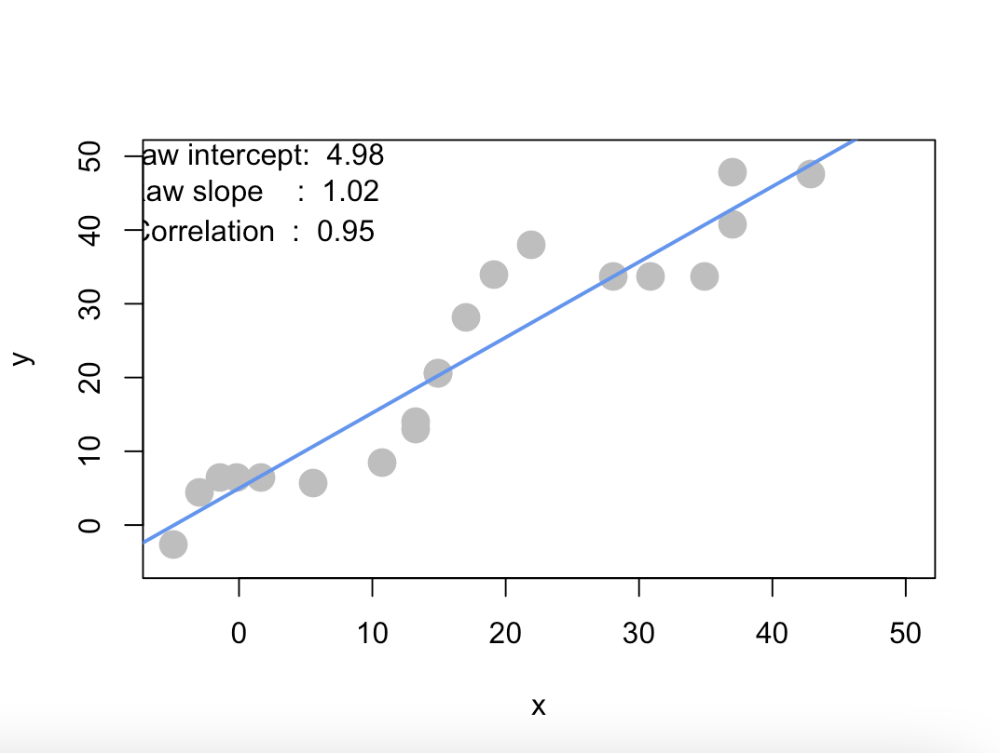
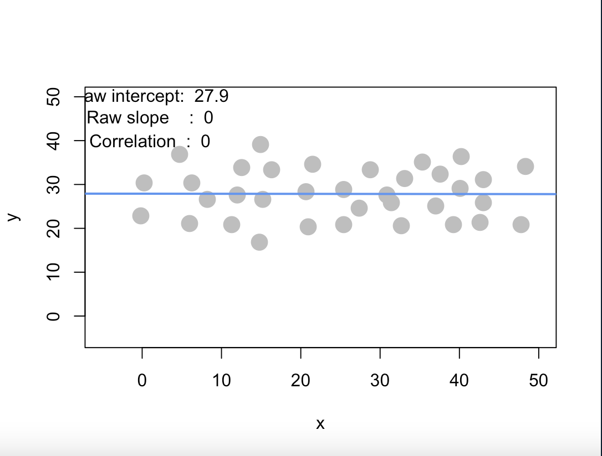
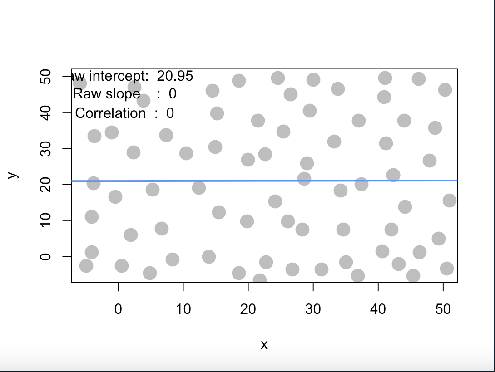
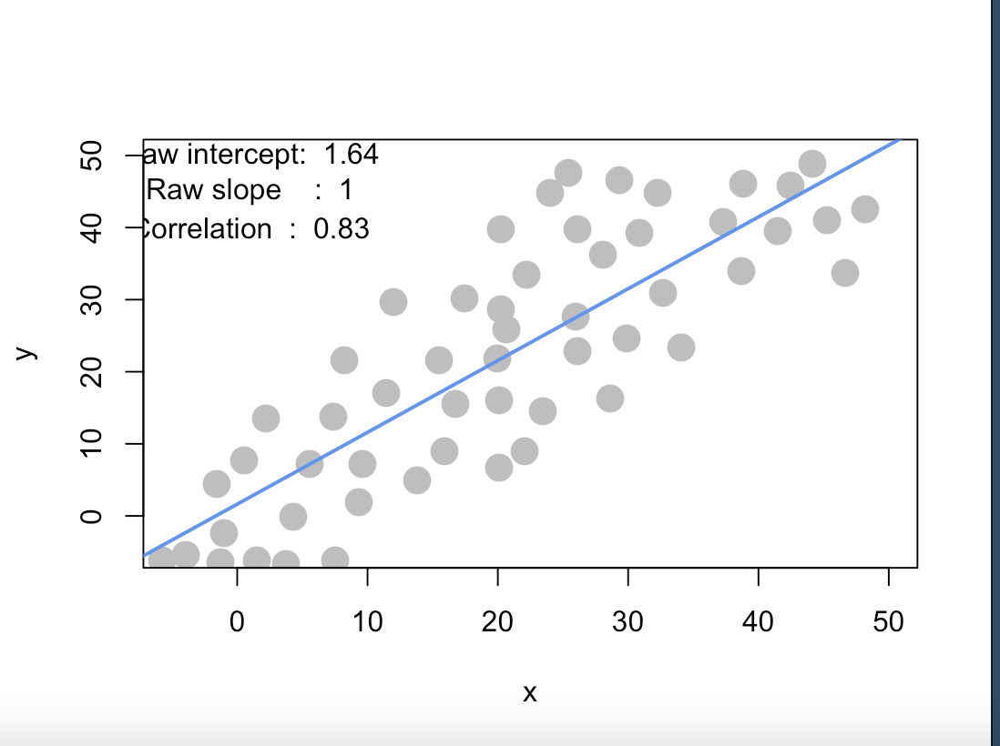
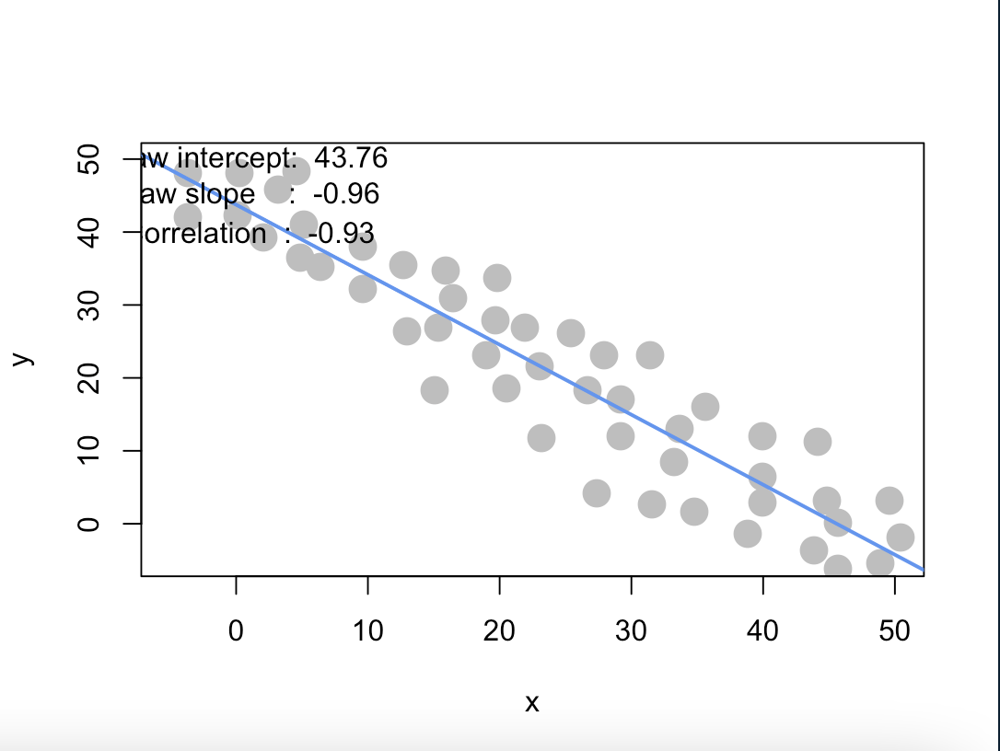
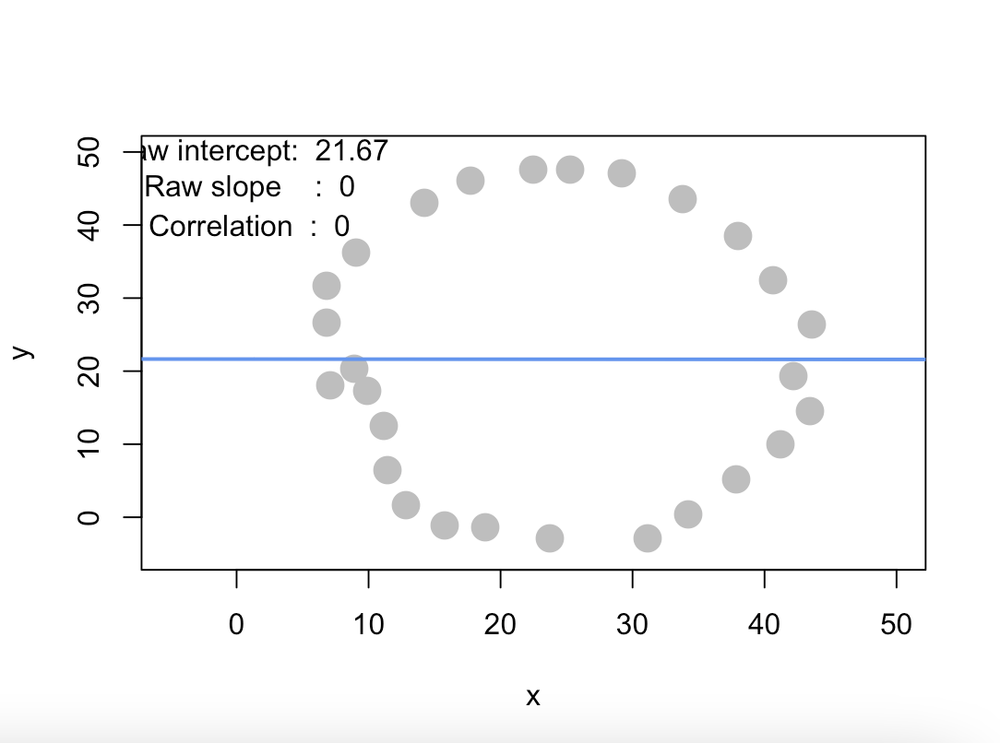
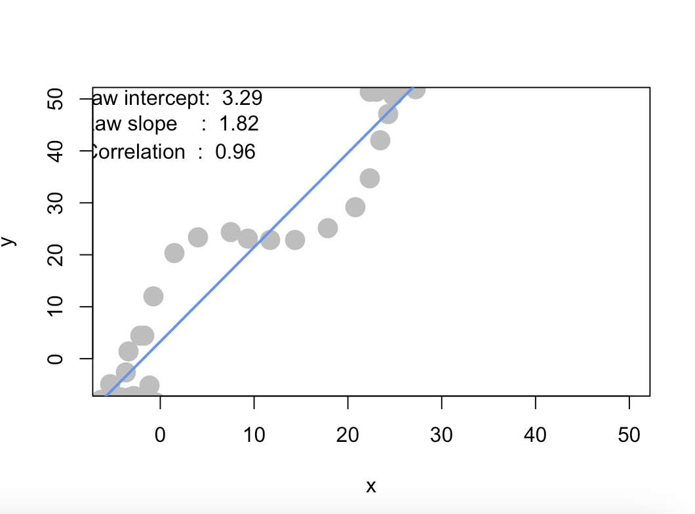

```{r setup, include=FALSE, out.width="50%", out.height="50%"}
knitr::opts_chunk$set(echo = TRUE,out.width="50%", out.height="50%")







```

## Question 1
### a.
#### i. How many recommendations does each bundle have?
**ANSWER :** 6 recommendation per bundle(IOS).

#### ii. Use intuition to recommend 5 bundles!
**ANSWER :** I chose Maroon5v first, then my recommendation are as follows:
1.beatsmusic 2. MonsterHigh 3. RetroSummer 4. New Years Party 5. xoxo

### b.
```{r}
library(data.table)
library(lsa)
ac_bundles_dt <- fread("piccollage_accounts_bundles.csv")
ac_bundles_matrix <- as.matrix(ac_bundles_dt[, -1, with=FALSE])
```
#### i. Create cosine similarities for all bundles
##### 1. Create top 5 recommend matrix or df
```{r}
similiar_matrix <- cosine(ac_bundles_matrix)
diag(similiar_matrix) <- 0 # won't be considered
recommend <- data.frame()
for(bundle in row.names(similiar_matrix)){
  recommend <- rbind(recommend,names(similiar_matrix[bundle, order(similiar_matrix[bundle,],decreasing = TRUE)]))
}
row.names(recommend) <- row.names(similiar_matrix)
colnames(recommend) <- c(1:ncol(similiar_matrix))
top5_recom <- recommend[,1:5]
head(top5_recom,3)
```

##### 2. Create a function to create top 5 recommend matrix
```{r}
mk_recom5 <- function(ac_bundles_matrix){
  similiar_matrix <- cosine(ac_bundles_matrix)
  diag(similiar_matrix) <- 0 # won't be considered
  recommend <- data.frame()
  for(bundle in row.names(similiar_matrix)){
    recommend <- rbind(recommend,names(similiar_matrix[bundle, order(similiar_matrix[bundle,],decreasing = TRUE)]))
  }
  row.names(recommend) <- row.names(similiar_matrix)
  colnames(recommend) <- c(1:ncol(similiar_matrix))
  top5_recom <- recommend[,1:5]
  return (top5_recom)
}
head(mk_recom5(ac_bundles_matrix),3)
```

##### 3.Top 5 of your chosen bundles
```{r}
top5_recom["Maroon5V",]
```
Not really surprised to see that Maroon5 is similiar to aliens, only aliens can make that kind of cool beatsmusic huh? Since aliens are here, it's quite normal that anatomy is here too. I heard that aliens are notorious for disecting homo sapiens, kinda gross lol.

#### ii. Create correlation based recommendations
```{r}
center_apply <- function(x) {
    apply(x, 2, function(y) y - mean(y))
}
centered_ac_bundles <- center_apply(ac_bundles_matrix)
head(mk_recom5(centered_ac_bundles),3)
```
The recommended items are still the same for Maroon5.

#### iii. Create adjusted cosine based recommendations
```{r}
transpose_ac <- t(ac_bundles_matrix)
center_apply <- function(x) {
    apply(x, 2, function(y) y - mean(y))
}
t_centered_ac_bundles <- center_apply(transpose_ac)
t1_centered_ac_bundles <- t(t_centered_ac_bundles)
head(mk_recom5(t1_centered_ac_bundles),3)
```
The recommended items changes slightly here, Maroon 5 is not similiar to aliens, and beatsmusic differs to this bundle more. However, anatomy is still in first place, which is quite odd indeed.

### c. Are the three sets of geometric recommendations similar in nature ? What reasons might explain why your computational geometric recommendation models produce different results from your intuition?
**ANSWER :** I guessed some right! However my guessing is just randomly picking the topics that I like, and the computational methods are based on distance, so obviously there will be difference.

### d. Conceptual difference in cosine similarity, correlation, and adjusted-cosine?
1. Cosine similarity can only calculate on vectors, hence the items are embedded into vectors first to calculate cosine distance.
2. Correlation is a statistical measure which doesn't use distance as heuristic but the expectation of the inputted features.
3. In our case, the adjusted cosine method can maintain balance due to the randomness of different users that will give different ratings.

## Question 2

### a. Create horizontal random points
<center>
{#id .class width=50% height=50%}
</center>

#### i. Raw Slope
**ANSWER: ** Since the points are horizontal, the slope would be expected to be around zero  $(0/x = 0)$, and thus the simulation proves it.

#### ii. Correlation
**ANSWER: ** Since the points are horizontal, the y points only hover up and down in a little amount. Hence, we can expect the correlation to be zero, since y can be seen as not altered by increasing x.


### b. Create a completely random set of points to fill the entire plotting area, along both x-axis and y-axis
<center>
{#id .class width=50% height=50%}
</center>

#### i. Raw Slope
**ANSWER: ** Since the points are distributed entirely and randomly in the plot, it can be expected that the raw slope will be near zero if the y axis and x axis are distributed evenly.

#### ii. Correlation
**ANSWER: ** Since the points are randomly distributed and filling the entire plot, it can be expected that the correlation will be about zero. Because the points are randomly distributed along the plot without any geometric meaning.

### c. Create a diagonal set of random points trending upwards at 45 degrees
<center>
{#id .class width=50% height=50%}
</center>

#### i. Raw Slope
**ANSWER: ** Since the points are distributed around a 45 degree angle line, the slope can be expected to be 1 $(y/x) = 1$.

#### ii. Correlation
**ANSWER: ** Since the x points trend the same as the y points, the expected correlation should be 1.

### d. Create a diagonal set of random trending downwards at 45 degrees
<center>
{#id .class width=50% height=50%}
</center>

#### i. Raw Slope
**ANSWER: ** Since the points are distributed around a 45 degree angle line but sloping downward, the slope can be expected to be -1 $(-y/x) = -1$.

#### i. Correlation
**ANSWER: ** Since the x points trend the exact opposite way as the y points, the expected correlation should be -1.

### e. Find another pattern of data points with no correlation
<center>
{#id .class width=50% height=50%}
</center>

We can easily see that this resembles an ugly circle, which can be described by $(x-25)^2+(y-25)^2 = r^2$ However, the x and y points do not have correlation.

### f. find another pattern of data points with perfect correlation
<center>
{#id .class width=50% height=50%}
</center>

This plot is highly correlated x and y, also able to find an odd degree polynomial equation to describe this plot too.

### g. How correlation relates to simple regression

#### i. Simulate points with interactive regression
```{r}
#pts <- interactive_regression() 
pts <- data.frame(x =c(-4.9244164,-2.9675264,-1.4299699,-0.1719691,1.6451431,5.5589232
 ,10.7307041, 13.2467056, 13.2467056,14.9240399, 14.9240399, 17.0207078,19.1173758,21.9129330,28.063158,30.8587161,34.9122741,37.0089420,37.0089420,42.8796122), y = c(-2.636982, 4.429640,6.448674,  6.448674,  6.448674,  5.691536
,8.467709, 13.010537, 14.020054, 20.581917, 20.581917, 28.153297
,33.958022 ,37.996091 ,33.705642, 33.705642 ,33.705642 ,40.772264
,47.838885 ,47.586506))
```
<center>
{out.width=50%, out.height=50%}
</center>

#### ii. Use the lm() function to estimate the regression intercept
```{r}
summary( lm( pts$y ~ pts$x ))
```

The slope and intercept is same in plot.

#### iii. Estimate the correlation of x and y
```{r}
cor(pts)
```
Same as indicated in plot, however it is quite obvious since the demo_simple_regression.R also uses *cor* function to calculate correlation.

#### iv. Re-estimate the regression using standardized values of both x and y from pts
```{r}
std_pts <- data.frame(x = scale(pts$x), y = scale(pts$y))
summary( lm( std_pts$y ~ std_pts$x ))
```
After standardization, the intercept is close to 0.
```{r}
cor(std_pts)
```
The correlation doesn't change after standarization.

#### v.Relationship between correlation and the standardized simple-regression estimates
The coefficients of the linear model(x) is the correlation of x and y points!
