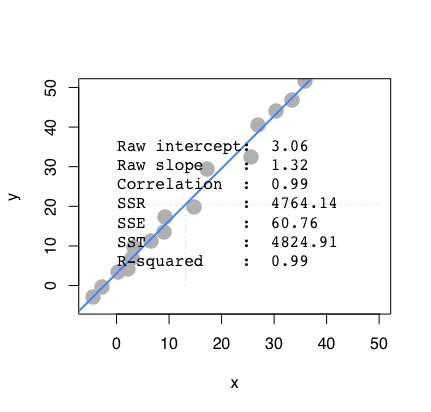
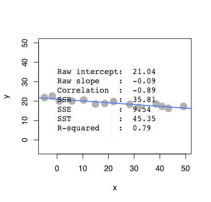
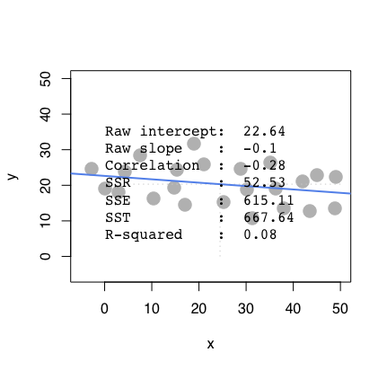

```{r setup, include=FALSE}
knitr::opts_chunk$set(echo = TRUE)
```

## Question 1 : Answer Questions by simulating the four scenarios below
###  a. What regression is doing to compute model fit
```{r}
pts <- data.frame(x = c(-3.719323,3.516220,10.942172,4.277856,11.894217,20.272214,  7.705219, 19.510578,10.942172,27.317348,21.414669,18.558533,30.935120,29.031030,18.368124,39.884344,26.365303,36.837800) ,y =c(1.905846,-3.646499, -2.636982, 12.001020, 8.467709,2.410605, 22.600952, 13.262916,30.424711,21.086676,30.172332, 39.257988,32.948504,39.257988,46.576988,41.024643,49.857920,47.838885))
regr <- lm(y ~ x, data=pts)
summary(regr)
```

```{r}
y_hat <- regr$fitted.values
plot(pts,main = "Regression Fitted Line",pch = 19)
abline(regr, col = 'blue')
segments(pts$x, pts$y, pts$x, y_hat, col="red", lty="dotted")
```

```{r}
regression_fit <- function(pts){
  regr <- lm(y~x,  data = pts)
  y_hat <- regr$fitted.values
  SSE <- sum((pts$y-y_hat)^2)
  SSR <- sum((mean(pts$y)-y_hat)^2)
  SST <- sum((pts$y-mean(pts$y))^2)
  Rsq <- SSR/SST
  return(data.frame(SSE = SSE, SSR = SSR, SST= SST, Rsq = Rsq))
}
regression_fit(pts)
```

### b. Compare Scenario 1, 2 which to expect to have stronger R square


**ANSWER: **  Since scenario 1 is obviously more closer to a fitted line because it's more dense, which also indicates it obtains a more stronger linear characteristic. Hence, we should expect Scenario 1 obtain higher R sqaure than Scenario 2

### c. Compare Scenario 3, 4 for larger R sqaure


**ANSWER: ** Since scenario 3 is more denser and obtain more linear characteristic, it will have higher r square compared to the more widespread distribution of scenario 4.

### d. Comparing scenarios 1 and 2, which do we expect has bigger/smaller SSE, SSR, and SST?

**ANSWER: ** SST and SSE of scenario 1 will be smaller than scenario 2, while SSR(depends on slope) for scenario 2 will be smaller than scenario 1. Because scenario 1 has a better fit than scenario 2.

### e. Comparing scenarios 3 and 4, which do we expect has bigger/smaller SSE, SSR, and SST?

**ANSWER: ** SST and SSE of scenario 3 will be smaller than scenario 4, while SSR(depends on slope) for scenario 4 will be smaller than scenario 3. Because scenario 3 has a better fit than scenario 2.

## Question 2.
```{r}
auto <- read.table("auto-data.txt", header=FALSE, na.strings = "?")
names(auto) <- c("mpg", "cylinders", "displacement", "horsepower", "weight", 
                 "acceleration", "model_year", "origin", "car_name")
```

### a. Explore Data
#### i. Visualize
```{r}
library(ggplot2)
ggplot(auto, aes(x=horsepower, y=mpg)) + geom_point()
```

This is a plot indicating that with bigger horsepower, the cars cannot achieve good fuel efficiency. Hence, there is a negative correlation here between horsepower and mpg.

#### ii. Correlation table
```{r}
cor_table <- cor(auto[,1:8], use = "pairwise.complete.obs")
cor_table
```

#### iii. Which variables seems to related to mpg
**ANSWER: ** According to the table above, seems like *cylinders, displacement, horsepower,weight,model_year* are negetively correlated to mpg. The other factors doesn't have a very strong positive correlation to mpg. 

#### iv. Which relations might not be linear?
```{r, warning=FALSE,error=FALSE}
library(GGally)
ggpairs(auto[1:8])
```

From the plot above, relationships  between *model_year,  origin,  cylinders* doesn't seem to show linear characteristics.

#### v. Are there any pairs of independent variables that are highly correlated
```{r}
library(reshape2)
diag(cor_table) <- 0
cor_melt <- melt(cor_table)
new_cor <- cor_melt[abs(cor_melt$value)>0.7,]
new_cor[!duplicated(new_cor[1:2]),]
```
`
### b. Create a linear regression model where mpg is dependent upon all other suitable variables
```{r}
regr <- lm(mpg ~ cylinders+displacement+horsepower+weight+acceleration+model_year+factor(origin)
           ,data = auto)
summary(regr)
```

#### i. which factors have significant on mpg at 1% significance?
**ANSWER: ** By the summary upon, the *intercept, displacement, weight, model_year, and origin have significant on mpg at 1% significance.

#### ii. Is it possible to determine which independent variables are most effective at increasing mpg?
**ANSWER: ** Not possible, since the variables aren't standardized, the scales for the factors are different. Hence we can not merely observe the coefficients and give out answers for this question.

###. c. Create standardized regression results
```{r}
sd_data <- cbind(scale(auto[1:7]),auto$origin)
colnames(sd_data) <- colnames(auto[1:8])
sd_df <- as.data.frame(sd_data)
new_regr <- lm(mpg~ cylinders+displacement+horsepower+weight+acceleration+model_year+factor(origin),data = sd_df)
summary(new_regr)
```

#### i. Are these figures easier to interpret?
Yes, it will be easier to interpret since we can see that weight is most effective at increasing mpg. Which is quite reasonable.

#### ii. Regress mpg over each nonsignificant independent variable. Which one will become significant over mpg?
```{r}
fit1 <- lm(mpg~cylinders,data = sd_df)
fit2 <- lm(mpg~displacement,data = sd_df)
fit3 <- lm(mpg~horsepower,data = sd_df)
fit4 <- lm(mpg~weight,data = sd_df)
fit5 <- lm(mpg~acceleration,data = sd_df)
fit6 <- lm(mpg~model_year,data = sd_df)
fit7 <- lm(mpg~origin,data = sd_df)
signifi<- function(fit){
   return (signif(summary(fit)$coef[2,4],2))
}
paste('cylinders:',signifi(fit1))
paste('displacement:',signifi(fit2))
paste('horsepower:',signifi(fit3))
paste('weight:',signifi(fit4))
paste('accerleration:',signifi(fit5))
paste('mdoel_year:',signifi(fit6))
paste('origin:',signifi(fit7))
```
**ANSWER: ** After fitted with every independent variable, they are all significant since the p-values are very low.

#### iii. Plot the density of the residuals, are they normally distributed and centered around zero?
```{r}
library(ggplot2)
regr_plt <- fortify(new_regr)
ggplot(new_regr,aes(.resid))+ geom_density()
```
**ANSWER: ** It's near a normal distribution with mean near 0. Can be verified by QQ plot.